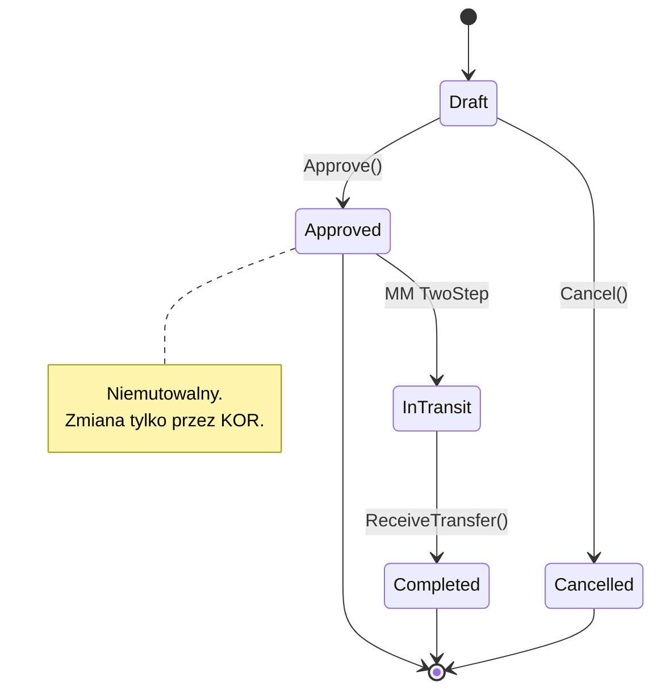
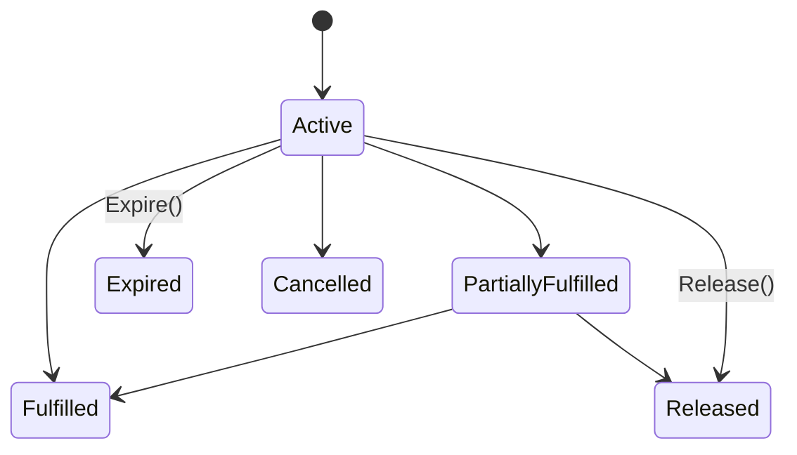
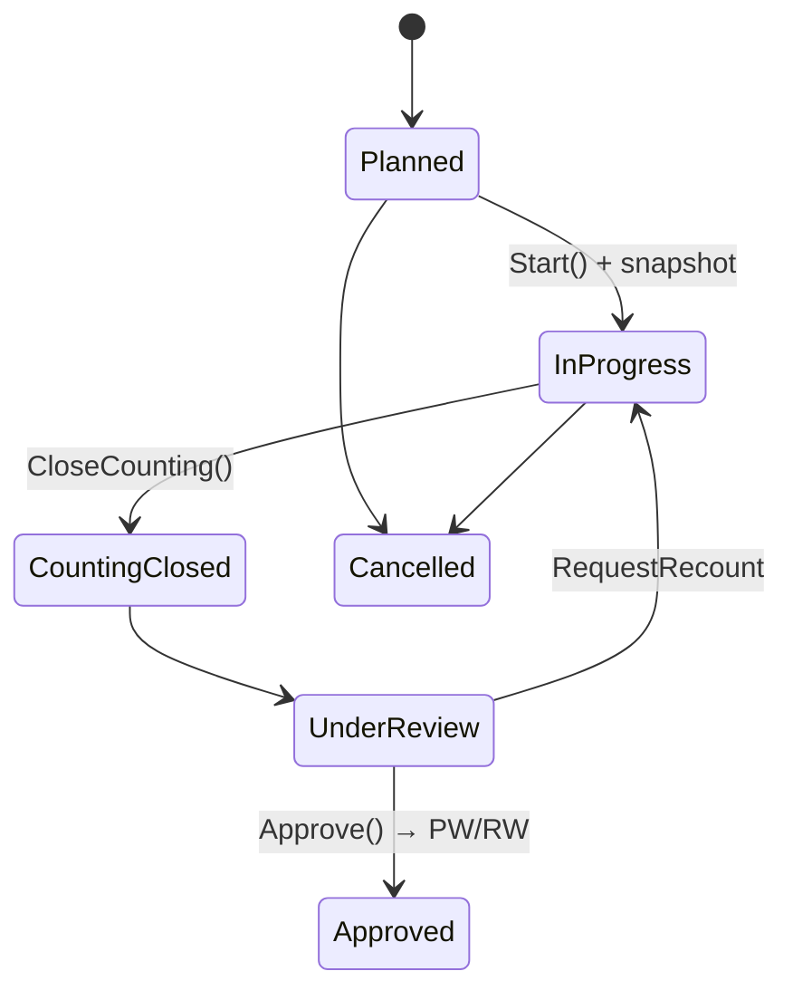
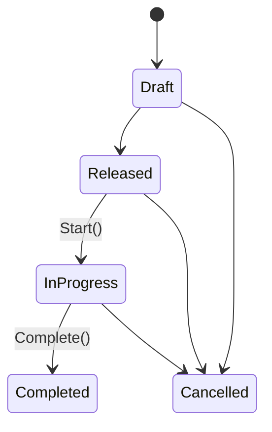

<!-- Fragment DOMENA.md (D10_maszyny_stanow). Pełny kontekst: ref/DOMENA.md -->

## 10. Maszyny stanów

```mermaid
stateDiagram-v2
    [*] --> Draft
    Draft --> Approved: Approve()
    Draft --> Cancelled: Cancel()
    Approved --> InTransit: MM TwoStep
    InTransit --> Completed: ReceiveTransfer()
    Approved --> [*]
    Completed --> [*]
    Cancelled --> [*]
    note right of Approved
      Niemutowalny.
      Zmiana tylko przez KOR.
    end note
```

```mermaid
stateDiagram-v2
    [*] --> Active
    Active --> PartiallyFulfilled
    PartiallyFulfilled --> Fulfilled
    Active --> Fulfilled
    Active --> Released: Release()
    Active --> Expired: Expire()
    Active --> Cancelled
    PartiallyFulfilled --> Released
```

```mermaid
stateDiagram-v2
    [*] --> Planned
    Planned --> InProgress: Start() + snapshot
    InProgress --> CountingClosed: CloseCounting()
    CountingClosed --> UnderReview
    UnderReview --> InProgress: RequestRecount
    UnderReview --> Approved: Approve() → PW/RW
    Planned --> Cancelled
    InProgress --> Cancelled
```

```mermaid
stateDiagram-v2
    [*] --> Draft
    Draft --> Released
    Released --> InProgress: Start()
    InProgress --> Completed: Complete()
    Draft --> Cancelled
    Released --> Cancelled
    InProgress --> Cancelled
```
